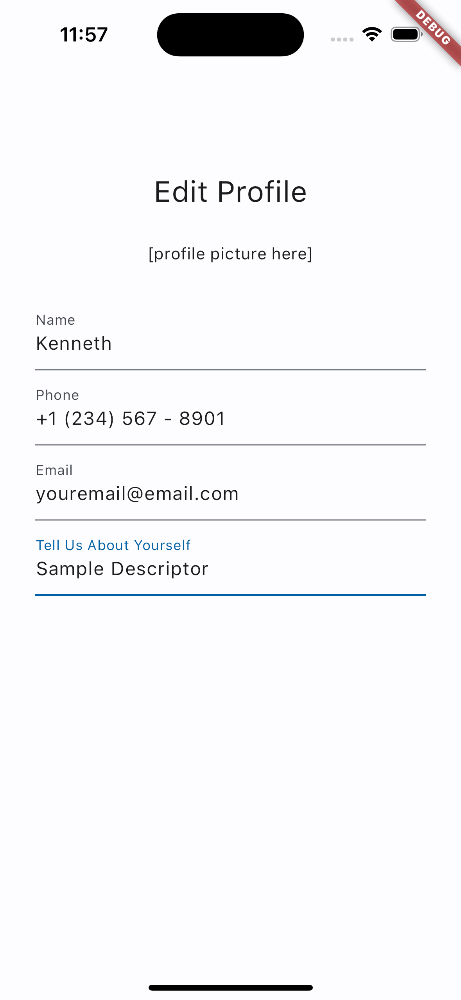
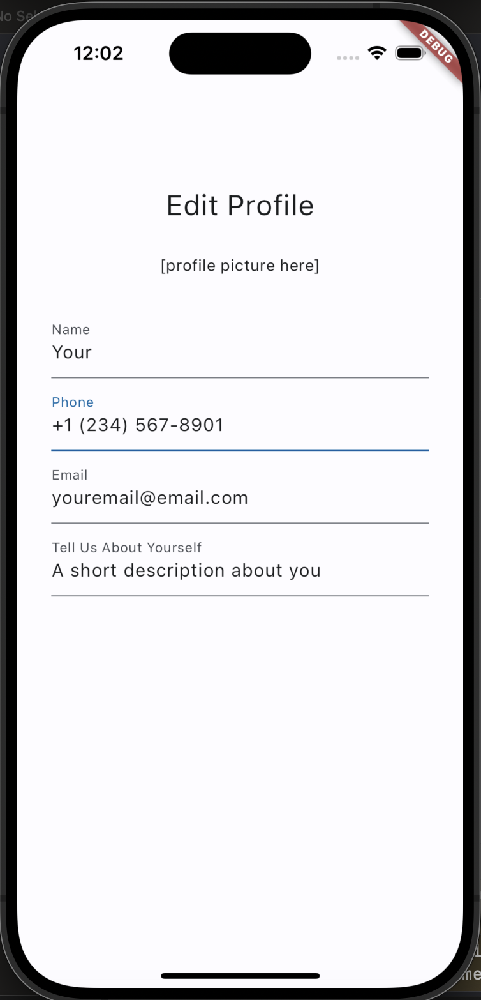

# ApproachableGeek Demo

This Flutter project was developed on MacOS and tested for MacOS (Desktop app) and iOS.






## Time Invested

- **Learning Flutter:**
  - 5 hours: Learning Flutter by reading documentation & Completion of "Write your first Flutter App"

- **Mobile Application Demo:**
  - 4.5 hours for design, implementation, testing, and documentation
 
## Prerequisites for Testing (iOS)

Before running the application on iOS, make sure you have Xcode installed.

- Install [Xcode](https://developer.apple.com/xcode/)

If the desktop application is also desired, then Flutter must be installed.
- Install [Flutter](https://docs.flutter.dev/get-started/install)

## Getting Started

1. **Clone the repository:**
    ```bash
    git clone https://github.com/your-username/approachablegeek_demo.git
    ```
2. **Running the application**
   ```
   Navigate to the approachablegeek_demo, open the project, and run the application!
   ```
3. **Open Xcodes, navigate to the project, and run the simulator**

4. **Enjoy the app!**

## To-Do
- Improve UI
- Implement profile page
- Fields not reflecting change when cleared.
